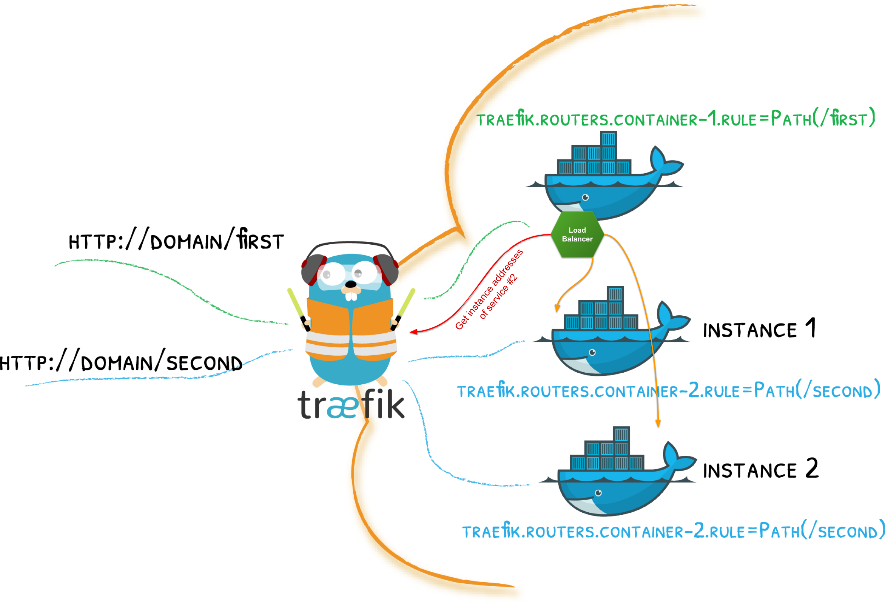

## Traefik Discovery Client

An implementation of Spring Cloud [DiscoveryClient][1] for [Traefik](https://docs.traefik.io) 
which allows performing load balanced inter-service calls.

[1]: https://github.com/spring-cloud/spring-cloud-commons/blob/master/spring-cloud-commons/src/main/java/org/springframework/cloud/client/discovery/DiscoveryClient.java